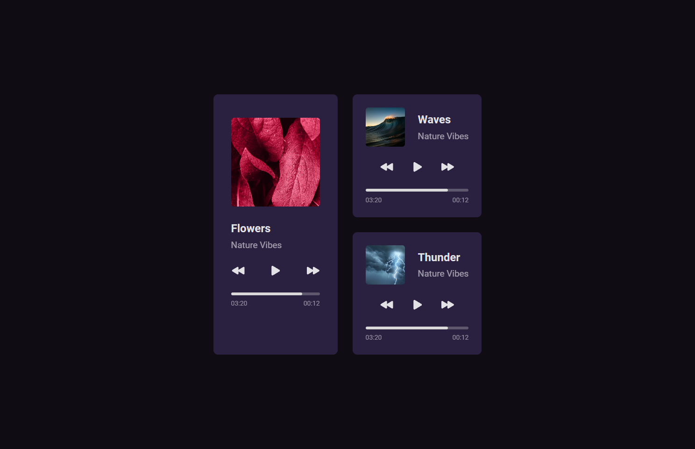

# Player de Música
Player de música desenvolvido no Desafio #01 do BoraCodar da Rocketseat.

  

[Clique aqui para acessar](https://marqueba.github.io/music-player/)

## 🚀 Tecnologias

Esse projeto foi desenvolvido com as seguintes tecnologias:

- ``HTML e CSS``
- ``Git e Github``

## Contato

| [ Marcos Reis Dutra](https://github.com/Marqueba)
